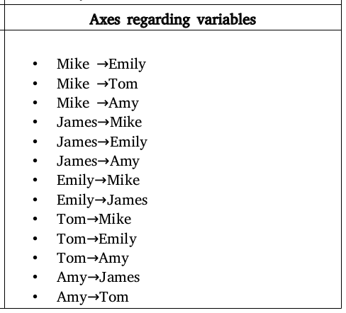
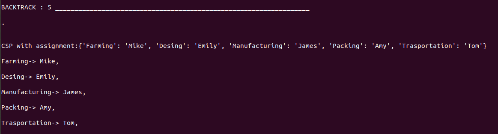

# Constraint Satisfaction Problems

The problem to be solved is the assignment of positions to a group of people according to established relationships,you can the person (variables), domains(positions) and the relationships.
The variables are:

The domains are:

And the positions are in two parts, the first is relationships and the positions

# USER MANUAL:

The user should open terminal and write:

	$ cd /path/where/dowland/is
	$ python3 csp2.py

And the result in the terminal is the next 

